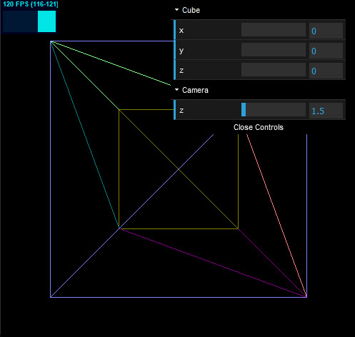

# Three.js-Boilerplate-TS-Vite

A Three.js Boilerplate for TypeScript Vite projects.

## Boilerplate Overview

When run, the boilerplate shows a multi-coloured wireframe cube, with `OrbitControls`, `Dat.GUI` and `Stats.js` included.



## Installing

```bash
git clone https://github.com/Aryandeep15/Three.js-Boilerplate-Learning-main
cd Three.js-Boilerplate-TS-Vite
npm install
```

### Develop

```
npm run dev
```

Visit [http://localhost:5173/](http://localhost:5173/)

### Build Production

```bash
npm run build
npm run preview
```

Visit [http://localhost:4173/](http://localhost:4173/)

